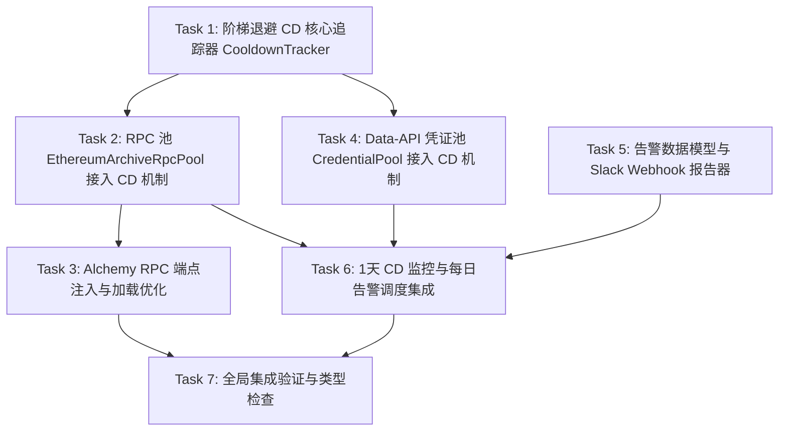

# 本次升级任务拆解清单 (tasks.md)

本任务清单专为代码 AI 执行设计。任务拆分细致，每个任务目标独立、边界明确，请按照依赖关系由前向后依次执行。

---

## 任务概览与依赖关系



---

### Task 1: 阶梯退避 CD 核心追踪器 (`CooldownTracker`) 与测试 [已完成]

- **执行状态**：已完成 (Passed)
- **任务目标**：
  实现一个无副作用、纯逻辑的阶梯退避冷却追踪器，负责管理单个节点/Key 的失败次数、CD 阶梯计算、冷却时间窗口、累计故障时长以及成功后重置。
- **要修改/新增的内容**：
  - 新建文件：`src/execution/CooldownTracker.ts`
  - 新建测试：`tests/unit/cooldown-tracker.test.ts`
- **实现要求**：
  1. CD 阶梯设定：
     - 第 1 次报错 CD：1 分钟（60,000 ms）
     - 第 2 次报错 CD：5 分钟（300,000 ms）
     - 后续叠加机制：逐步递增（推荐阶梯：1m -> 5m -> 15m -> 30m -> 1h -> 2h -> 4h -> 8h -> 12h -> 24h），最高封顶 1 天（24 小时 = 86,400,000 ms）。到达 1 天后维持 1 天。
  2. 核心状态与方法：
     - `recordFailure(now?: number)`: 增加连续失败计数，更新当前 CD 时长，设置 `cooldownUntil = now + cdMs`。如果是该轮首次失败，记录 `firstFailureAt = now`。
     - `recordSuccess()`: 连续失败次数清零，清空 `cooldownUntil`、`currentCooldownMs`、`firstFailureAt`。
     - `isCoolingDown(now?: number): boolean`: 判断当前时间是否在 CD 冷却期内（即 `cooldownUntil !== null && cooldownUntil > now`）。
     - `isMaxCooldown(): boolean`: 判断当前 CD 是否已达到最长 1 天（86,400,000 ms）。
     - `getTotalCooldownDuration(now?: number): number`: 计算从首次失败进入 CD 至今的累计总时长（`now - firstFailureAt`），未处于故障时返回 0。
     - `getState()`: 返回只读状态快照（禁止包含任何敏感信息）。
  3. 支持通过构造函数注入 `Clock` 接口（`src/execution/clock.ts`），保证测试可使用 `FakeClock` 快速快进时间。
- **验收标准**：
  1. 单元测试覆盖：
     - 首次调用 `recordFailure()` 后，冷却期为 1 分钟；
     - 再次调用 `recordFailure()` 后，冷却期增加为 5 分钟；
     - 持续失败最终封顶为 24 小时，不再无限增长；
     - 时钟未到 CD 结束时，`isCoolingDown()` 为 `true`；时钟超过后为 `false`；
     - 调用 `recordSuccess()` 后，状态全部重置，`isCoolingDown()` 为 `false`，累计时间清零；
     - `getTotalCooldownDuration()` 正确计算累计处于 CD 的时长。
  2. 运行 `pnpm vitest run tests/unit/cooldown-tracker.test.ts` 100% 通过。
- **依赖的任务**：无。

---

### Task 2: RPC 池 (`EthereumArchiveRpcPool`) 接入阶梯 CD 机制 [已完成]

- **执行状态**：已完成 (Passed)
- **任务目标**：
  优化以太坊/多链归档 RPC 池，在 RPC 端点发生网络或调用报错时按阶梯退避进入 CD；冷却期内的端点不被选中；冷却到期后允许尝试；调用成功后立即清除 CD。
- **要修改的内容**：
  - 修改文件：`src/rpc/EthereumArchiveRpcPool.ts`
  - 修改测试：`tests/unit/ethereum-archive-rpc-pool.test.ts`
- **实现要求**：
  1. 在 `EthereumArchiveRpcPool` 内部为每个 endpoint（通过 `endpoint.id` 映射）绑定一个 `CooldownTracker`。
  2. 修改 `reportOutcome(id: string, outcome: ArchiveRpcOutcome)`：
     - 当 `outcome === "failure"` 时，调用该 endpoint 的 `tracker.recordFailure()`，更新其冷却状态。
     - 当 `outcome === "success"` 时，调用该 endpoint 的 `tracker.recordSuccess()`，清除其 CD。
  3. 修改 `healthySnapshot(randomSource)`：
     - 过滤候选端点时，不仅判断 probe 健康状态，还必须判断当前未处于 CD 冷却中（`!tracker.isCoolingDown()`）。
     - 处于 CD 中的端点自动排除在随机洗牌列表外。
  4. 当端点冷却时间到期后，下一次获取快照或执行时允许重新被选中（最长 1 天可能调用一次）。
  5. 暴露状态查询接口：
     - 提供 `getEndpointCooldownState(id: string)` 或 `getAllCooldownStates()`，返回包含 endpoint ID、是否处于 1 天 CD、已处于 CD 的总时长等信息的只读列表（供告警模块采集）。
- **验收标准**：
  1. 单元测试覆盖：
     - 端点调用失败后进入 1 分钟 CD，此时 `healthySnapshot` 中不包含该端点；
     - 快进时钟 1 分钟后，该端点重新出现在可用快照中；
     - 再次调用失败后进入 5 分钟 CD；
     - 调用成功后 CD 立即清除；
     - 提供查询接口能正确返回达到 1 天 CD 的端点及其累计时长。
  2. 运行 `pnpm vitest run tests/unit/ethereum-archive-rpc-pool.test.ts` 全部通过。
- **依赖的任务**：Task 1。

---

### Task 3: Alchemy RPC 端点加入 RPC 池配置与加载支持 [已完成]

- **执行状态**：已完成 (Passed)
- **任务目标**：
  解决“默认 Alchemy 不会加入 RPC 池子”的问题，规范 Alchemy RPC 端点的注册流程，当配置了 `ALCHEMY_API_KEY` 时支持将其加入到 RPC 池中，享受统一的随机调度与 CD 管理。
- **要修改的内容**：
  - 修改文件：`src/env/EnvLoader.ts`
  - 修改文件：`src/client/EvmDataClient.ts`
  - 修改测试：`tests/unit/env-loader.test.ts`
- **实现要求**：
  1. 检查 `EnvLoader.ts`：
     - 确保 `getRpcEndpoints("ethereum")` 等支持从 `ALCHEMY_API_KEY` / `ALCHEMY_RPC_KEY` 正确派生出 `alchemy-ethereum-1` 等 endpoint 配置（URL 形如 `https://eth-mainnet.g.alchemy.com/v2/${key}`）。
     - 为端点标记或记录其来源环境变量名（如 `envKeyName: "ALCHEMY_API_KEY"`）。
  2. 修改 `src/client/EvmDataClient.ts` 初始化 RPC 池的逻辑：
     - 在构建 `archiveRpcPool` 时，若存在来自 Alchemy 的 RPC 端点配置（且未被禁用），将其与内置公共端点、自定义端点一同合并注入 RPC 池。
     - 保持原有端点 ID 去重逻辑，端点 ID 严格保证唯一。
  3. 保留安全要求：URL 包含 key 视为秘密，在日志、异常或状态暴露中只显示 endpoint ID（如 `alchemy-ethereum-1`）与 `envKeyName`（`ALCHEMY_API_KEY`），绝不泄露 API Key 原值。
- **验收标准**：
  1. 单元测试覆盖：
     - 配置了 `ALCHEMY_API_KEY` 时，通过 `EnvLoader` 或客户端初始化能检测到 Alchemy RPC 端点已包含在 `archiveRpcPool` 中；
     - Alchemy RPC 发生报错时与公共 RPC 一样能正确进入 CD 阶梯。
  2. 运行 `pnpm vitest run tests/unit/env-loader.test.ts` 和相关 client 测试全部通过。
- **依赖的任务**：Task 2。

---

### Task 4: Data-API 凭证池 (`CredentialPool`) 接入阶梯 CD 机制与 Env Key 关联 [已完成]

- **执行状态**：已完成 (Passed)
- **任务目标**：
  让 Data-API 凭证池（管理 Etherscan、Alchemy 等 API Key）在遇到限流或服务报错时接入阶梯退避 CD 机制；记录凭证对应的环境变量名称，并支持导出达到 1 天 CD 的凭证状态。
- **要修改的内容**：
  - 修改文件：`src/execution/CredentialPool.ts`
  - 修改文件：`src/env/EnvLoader.ts`
  - 修改测试：`tests/unit/pools.test.ts`
- **实现要求**：
  1. 扩展凭证入参及条目信息：
     - `CredentialLease` 或构造入参支持可选的 `envKeyName?: string`（例如 `"ETHERSCAN_API_KEY_1"`，在 `EnvLoader` 解析 providers 时一并传入）。
     - 每个 `CredentialEntry` 维护一个 `CooldownTracker`。
  2. 修改 `report(lease, outcome)`：
     - 当 `outcome === "rate_limited"` 或出现 API 服务调用异常时，调用 `tracker.recordFailure()`，进入 1m -> 5m -> ... -> 24h 阶梯 CD。
     - 当 `outcome === "success"` 时，调用 `tracker.recordSuccess()` 清除 CD。
     - 若 `outcome === "authentication_failed"`，仍按现有逻辑标记永久 `disabled`。
  3. 修改 `acquire()`：
     - 检查 `tracker.isCoolingDown()`，处于 CD 期间的凭证不予分配。
     - 冷却到期后，该凭证可以再次被借出尝试。
  4. 暴露状态查询接口：
     - 提供 `getMaxCooldownCredentials()` 或 `getCooldownState(id: string)`，返回包含凭证 ID、`envKeyName`、是否处于 1 天 CD、累计处于 CD 的总时长等信息的只读列表。
- **验收标准**：
  1. 单元测试覆盖：
     - Data-API 凭证报告限流后进入 1 分钟 CD，此时 `acquire()` 跳过该凭证；
     - 推进时间至 1 分钟后，凭证再次可借出；
     - 连续限流/报错，冷却时间依次递增至 24 小时封顶；
     - 调用成功后立即清除 CD；
     - 能够通过状态方法正确读取凭证的 `envKeyName` 与持续故障总时长。
  2. 运行 `pnpm vitest run tests/unit/pools.test.ts` 全部通过。
- **依赖的任务**：Task 1。

---

### Task 5: 报警数据模型与 Slack Webhook 报告器实现 [已完成]

- **执行状态**：已完成 (Passed)
- **任务目标**：
  构建一个独立的 Slack Webhook 告警报告组件，负责将达到 1 天 CD 的 API Key / RPC 节点格式化成易读报告，并通过 Webhook 发送到 Slack；严格执行数据脱敏。
- **要修改/新增的内容**：
  - 新建文件：`src/alert/SlackWebhookReporter.ts`
  - 新建测试：`tests/unit/slack-webhook-reporter.test.ts`
- **实现要求**：
  1. 定义故障项结构 `AlertFaultItem`：
     ```typescript
     export interface AlertFaultItem {
       readonly id: string;            // 节点或凭证ID，如 "alchemy-ethereum-1", "etherscan-main-key-1"
       readonly category: "rpc" | "data-api";
       readonly envKeyName: string;    // 对应的 env 变量名，如 "ALCHEMY_API_KEY", "ETHERSCAN_API_KEY_1"；公共节点可为 "BUILTIN_PUBLIC"
       readonly detail: string;        // 描述详情（例如 chain: ethereum, provider: alchemy）
       readonly totalCooldownDurationMs: number; // 累计进入 CD 的总时长
       readonly currentCooldownMs: number;       // 当前 CD 时长（需为 86,400,000ms 即 1 天）
     }
     ```
  2. 格式化逻辑：
     - 将时长换算为易读文本（例如 `"26小时 15分钟"` 或 `"1天 2小时"`）。
     - 生成 Slack 消息 Payload（包含标题、故障列表、环境变量名称、累计故障时长）。
     - 严格安全：严禁输出任何实际 API Key 字符或 URL query 中的 token。
  3. 发送逻辑：
     - 通过 HTTP POST（使用可注入的 `HttpTransport` 或全局 `fetch`，保证单测可完全 mock）向 webhook URL 提交 JSON 数据。
     - 捕获并妥善处理网络异常，不能因报警发送失败导致 SDK 主流程崩溃。
- **验收标准**：
  1. 单元测试覆盖：
     - 给定故障项列表，生成符合 Slack Incoming Webhook 规范的 JSON 载荷；
     - 报告文本中包含故障端点 ID、envKeyName、格式化累计时长；
     - 验证载荷中绝对不含敏感密钥；
     - Mock transport 收到正确的 POST 请求，网络异常被安全捕获。
  2. 运行 `pnpm vitest run tests/unit/slack-webhook-reporter.test.ts` 全部通过。
- **依赖的任务**：无（纯格式化与 Webhook 传输，使用 Fake Transport 测试）。

---

### Task 6: 1天 CD 监控扫描与每日告警调度集成 [已完成]

- **执行状态**：已完成 (Passed)
- **任务目标**：
  在客户端集成告警功能：默认不开启；仅当配置了 Webhook 时启用；当存在达到 1 天 CD 的公共 RPC、API Key RPC 或 Data-API 时，每天发送一次报告（24 小时间隔控制）。
- **要修改的内容**：
  - 修改文件：`src/domain/configuration.ts`（增加 `alert` 配置项）
  - 修改文件：`src/env/EnvLoader.ts`（支持从环境变量加载 Webhook 配置）
  - 修改文件：`src/client/EvmDataClient.ts`（集成告警检测与上报）
  - 新建/修改测试：`tests/unit/alert-service.test.ts`
- **实现要求**：
  1. 配置扩展（`src/domain/configuration.ts`）：
     - 增加 `alert` 配置段：
       ```typescript
       export interface AlertConfiguration {
         readonly enabled?: boolean;           // 默认 false
         readonly slackWebhookUrl?: string;    // Slack Webhook URL
         readonly reportIntervalMs?: number;   // 默认 86_400_000 (1 天)
       }
       ```
     - 使用 Zod schema 进行格式校验。
  2. 环境变量支持（`src/env/EnvLoader.ts`）：
     - 支持读取 `SLACK_WEBHOOK_URL` 或 `ALERT_SLACK_WEBHOOK`，并组装进客户端配置。
  3. 告警检测与 24 小时控制（`src/client/EvmDataClient.ts` 或独立的 `AlertService`）：
     - 提供 `checkAndReportAlerts(now?: number): Promise<boolean>` 方法。
     - 默认若未配置 Webhook 或 `enabled` 为 false，直接返回 false，不执行任何操作。
     - 收集 `archiveRpcPool` 和 `credentialPools` 中所有满足 `isMaxCooldown()`（即达到 1 天 CD）的故障项。
     - 若故障列表为空，不发送消息。
     - 控制发送频次：记录 `lastReportSentAt` 时间戳。若 `now - lastReportSentAt < 86_400_000`（1 天），则跳过本次发送，保证 1 天最多发送一次。
     - 若满足条件，调用 `SlackWebhookReporter` 发送报告，并更新 `lastReportSentAt`。
  4. 符合 `Agent.md` 规范：不自动启动不可控的 Node.js 隐式后台死循环定时器；提供安全生命周期或在执行请求间隙/显式方法中执行检查。
- **验收标准**：
  1. 单元测试覆盖：
     - 默认不开启时，不触发任何请求；
     - 配置了 Webhook 但无 1 天 CD 故障时，不发送；
     - 存在 1 天 CD 故障时，成功向 Webhook 发送一次报告；
     - 发送后 1 小时内再次触发，不重复发送；
     - 推进时钟至 24 小时之后且故障仍存在，成功发送第二次每日报告；
     - 故障恢复（调用成功重置 CD）后，不再包含在报警列表中。
  2. 运行 `pnpm vitest run tests/unit/alert-service.test.ts` 全部通过。
- **依赖的任务**：Task 2, Task 4, Task 5。

---

### Task 7: 全局集成验证与类型检查门禁 [已完成]

- **执行状态**：已完成 (Passed)
- **任务目标**：
  对所有修改内容进行统一的工程质量验证，确保没有引入类型错误、代码规范违规或测试回归。
- **要修改/验证的内容**：
  - 全局代码与测试
- **实现要求**：
  - 运行项目标准的完整检查流程。
  - 使用 `pnpm` 包管理器执行命令。
  - 确保所有新加文件均符合 ESLint 规则和 TypeScript 严格模式。
- **验收标准**：
  1. `pnpm typecheck` 零类型报错。
  2. `pnpm lint` 零代码格式与规范警告/报错。
  3. `pnpm test` 全量测试用例通过。
  4. `pnpm build` 成功完成打包产物构建。
  5. `pnpm test:package` 打包 smoke 测试通过。
- **依赖的任务**：Task 1 至 Task 6。

---

## 执行与验收记录总结

| 任务 | 核心实现/修改文件 | 关联测试文件 | 测试结果 | 状态 |
|---|---|---|---|---|
| **Task 1** | `src/execution/CooldownTracker.ts` | `tests/unit/cooldown-tracker.test.ts` | 5/5 通过 | 已完成 |
| **Task 2** | `src/rpc/EthereumArchiveRpcPool.ts` | `tests/unit/ethereum-archive-rpc-pool.test.ts` | 18/18 通过 | 已完成 |
| **Task 3** | `src/env/EnvLoader.ts`, `src/client/EvmDataClient.ts` | `tests/unit/env-loader.test.ts` | 14/14 通过 | 已完成 |
| **Task 4** | `src/execution/CredentialPool.ts`, `src/providers/DataProviderAdapter.ts` | `tests/unit/pools.test.ts` | 9/9 通过 | 已完成 |
| **Task 5** | `src/alert/SlackWebhookReporter.ts` | `tests/unit/slack-webhook-reporter.test.ts` | 6/6 通过 | 已完成 |
| **Task 6** | `src/alert/AlertService.ts`, `src/client/EvmDataClient.ts`, `src/domain/configuration.ts` | `tests/unit/alert-service.test.ts` | 4/4 通过 | 已完成 |
| **Task 7** | 全局类型定义与导出 `src/index.ts` | 全量测试套件 (47 文件 / 463 用例) | 全部通过 | 已完成 |

**门禁验证输出**：
- `pnpm typecheck`: 0 错误
- `pnpm lint`: 0 警告 / 0 错误
- `pnpm test`: 47 test files passed, 463 tests passed
- `pnpm build`: 打包成功 (dist/index.js, dist/index.d.ts, dist/index.mjs, dist/index.d.mts)
- `pnpm test:package`: 打包产物 smoke 验证通过

